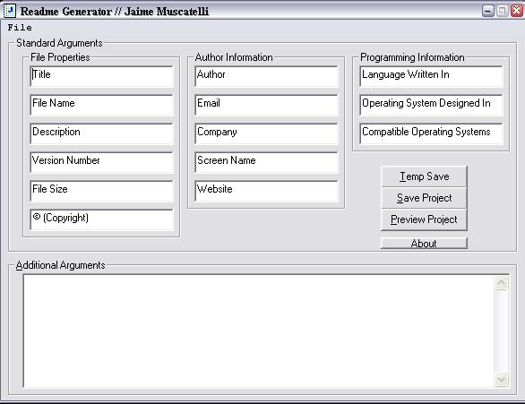



## A Readme txt File Generator

### Description

Tired of writing readme files for your programs? Fear not, for there is now a generator for you to compile them with the ease. This may seem like a simple process, but it will save you time in the long run. The code is quite simple, and I use classes extensively, so if you want to learn classes check this out. It has a previewer, save function (obviously), and it is easy to use. Code is easy to read; this may actually help you out!
 
### More Info
 

             |
---                |---
**Submitted On**   |2002-12-30 18:54:40
**By**             |[Jaime Muscatelli](https://github.com/Planet-Source-Code/PSCIndex/blob/master/ByAuthor/jaime-muscatelli.md)
**Level**          |Intermediate
**User Rating**    |4.6 (32 globes from 7 users)
**Compatibility**  |VB 6\.0
**Category**       |[Complete Applications](https://github.com/Planet-Source-Code/PSCIndex/blob/master/ByCategory/complete-applications__1-27.md)
**World**          |[Visual Basic](https://github.com/Planet-Source-Code/PSCIndex/blob/master/ByWorld/visual-basic.md)
**Archive File**   |[A\_Readme\_t15208212302002\.zip](https://github.com/Planet-Source-Code/jaime-muscatelli-a-readme-txt-file-generator__1-42016/archive/master.zip)

